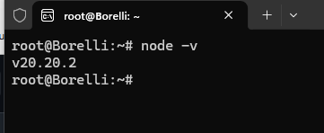
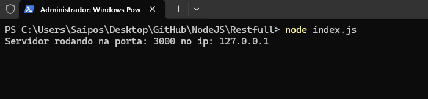
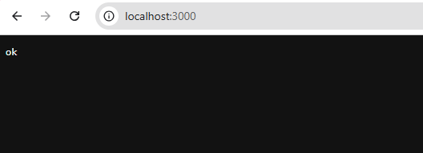
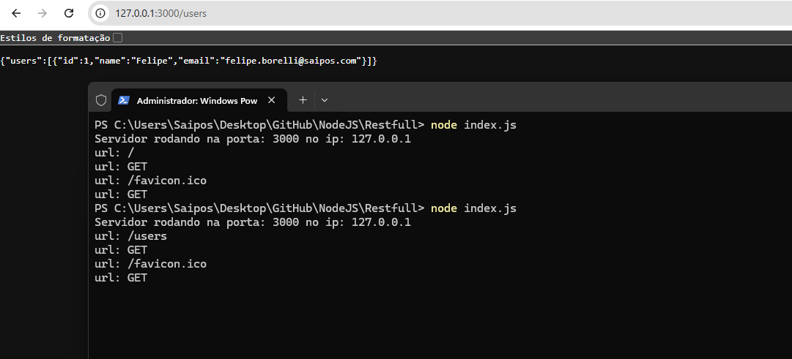
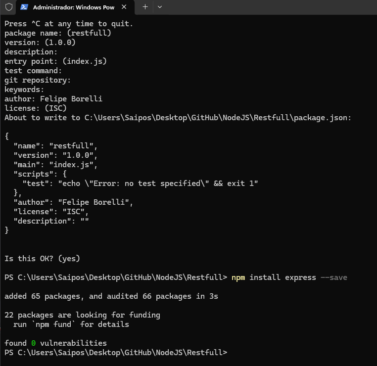
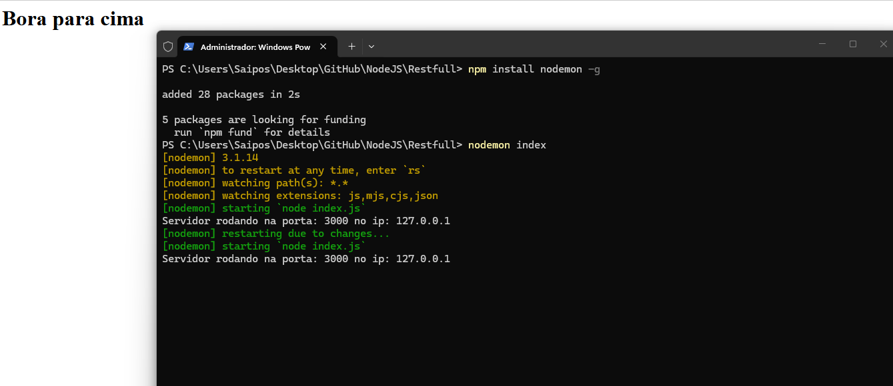
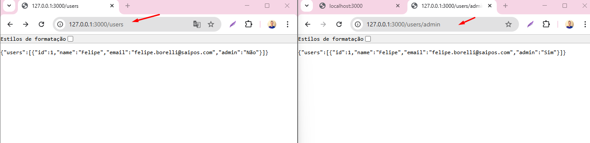
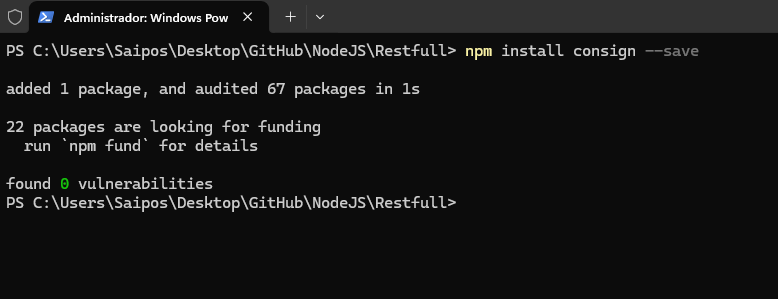
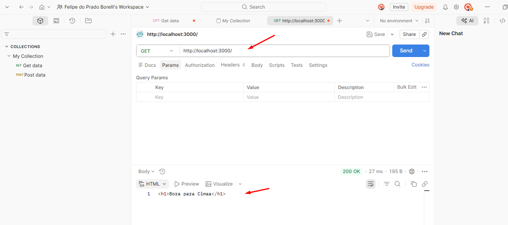
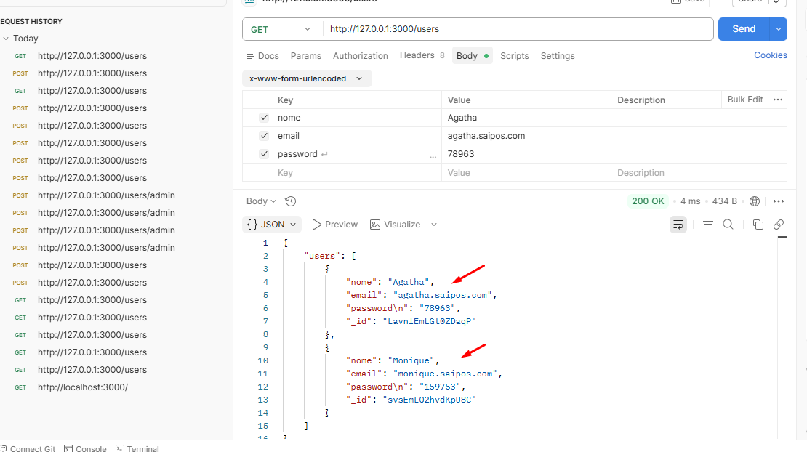

# Curso NodeJS - JavasScript no Back-End ( Projeto em Andamento )

### 62. N01 - Introdução ao NodeJS
- Aprendi que o Node usa o motor V8 para rodar JavaScript no servidor e que o NPM gerencia pacotes e biblioteca

**O V8 é o motor JavaScript criado pelo Google para o navegador Chrome**

**O NPM (Node Package Manager) é o gerenciador de pacotes do Node.js**

### 63. N02 - Instalando o NodeJS
- Como já tinha a instalação do nó no computador, apenas acompanhei a aula. E visualizei a versão.

## 64. N03 - Criando um Servidor Web com Node.JS
- aprendi a criar um servidor local e uma porta especifica.

## 65. N04 - Detectando URL diferente
- Utilizamos a estrutura switch para criar um roteamento que identifica a URL acessada pelo navegador. Se o caminho for '/', o servidor responde com um HTML, e se for '/users', ele entrega um JSON
-

## 66. N05 - Entendendo o Package.Json e Instalando o Express

- O NPM (Node Package Manager) é o gerenciador de pacotes do Node.js
- Package.JSON - Ponto de partida, dentro dele que fica o codigo e os modulos.

## 67. N06 - Nodemon e Criando o Servidor com Express
- Instalando o Nodemon para ficar atualizando de forma automatca sem precisar ficar parando e iniciando no terminal a cada atualização.

## 68. N07 - Separando Rotas do Arquivo Principal
-Aprendi a criar uma rota para cada arquivo para ficar mais estrutura o projeto.

## 69. N08 - Carregando Rotas com Consign
- Instalando o CONSIGN

Simplificamos as rotas não precisando importar arquivo para cada rota, e deixamos de uma maneira mas limpa, deixando tudo na pasta do consign (app).

## 70. N09 - Recebendo dados via POST e instalando
- Instalando Postman e testando o servidor e instalei o body-parse

## 71. N10 - Persistência de dados com o NeDB (Banco de dados JavaScript)
- Instalando o NeDB e armazenando as rotas que estão sendo enviadas via Postman.

## 72. N11 - Listando os usuários do banco NeDB
-Usando o método find, eu busco todos os usuários do arquivo 'users.db' passando um objeto vazio para retornar todos os registros. Em vez de usar o if/else tradicional para o erro do callback, utilizo o bloco try/catch para capturar exceções durante a execução. Caso o processo ocorra com sucesso, o servidor retorna a lista de usuários; se ocorrer algum erro, ele interrompe o fluxo e envia o erro no formato JSON com o status 400
